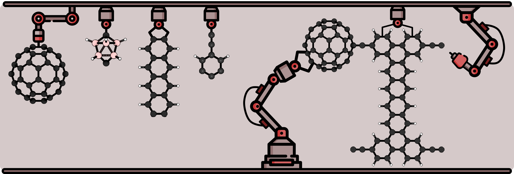
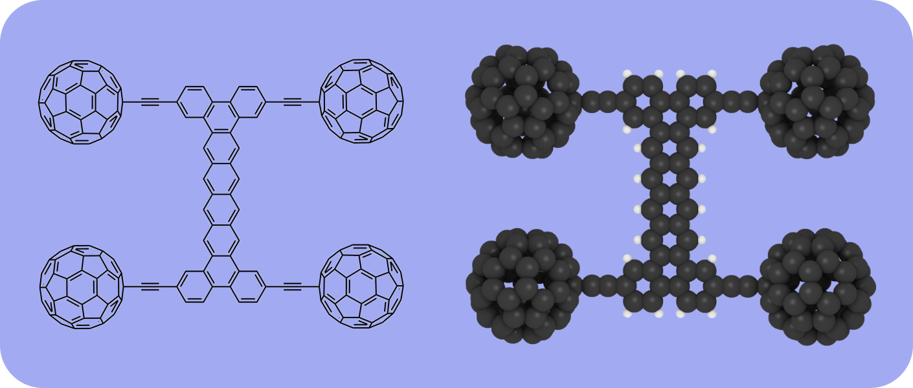

### What is Formula Nano?

Formula Nano is a scientific competition that aims to advance the way we design and test the performance of [molecular machines](https://en.wikipedia.org/wiki/Molecular_machine). In this race, the *cars* are single molecules consisting of a few hundred atoms and the track is a pristine metal surface that is only 100 nm long. The goal is to come up with the best molecular design (nanocar) optimized to diffuse on a particular surface like gold.

  <iframe width="560" height="315" src="https://www.youtube.com/embed/JJDOcXZzJXs" title="YouTube video player" frameborder="0" allow="accelerometer; autoplay; clipboard-write; encrypted-media; gyroscope; picture-in-picture" allowfullscreen></iframe>

The idea is to design the fastest molecule, i.e. a [nanocar](https://en.wikipedia.org/wiki/Nanocar),
that can diffuse on a particular surface.
Formula Nano is inspired by the [Nanocar Race in 2017](https://en.wikipedia.org/wiki/Nanocar_Race),
where 6 teams of scientists raced their molecules using electron microscopes.

<h3>Why Formula Nano?</h3>

We believe learning how to design better nanocars is a small but important step towards the broader goal of learning how to build molecular scale machines or "nanomachines". Pretty much all of the miracles of Nature are accomplished using molecular machines that are a few nanometers large. For example, the cells in your body can be thought of as tiny robots that perform many complex functions, such as moving, eating, and self-replicating. Within cells are even smaller biological machines: motors, conveyor belts, you name it.  At this point, scientists really have not made any synthetic nanomachines at all. We are still at the "trying to make nuts and bolts" stage of nanomachine research, and because of that it is hard to envision the practical social benefits in the short term. In the long term, however, future nanomachines may be able to do everything Nature does today and more. Fighting disease, harvesting mass and energy to build atomically precise objects, reconfigurable matter, the number of science-fiction-like sounding applications is endless.

<h3> How does it work? </h3>

You can check out our web nanocar builder (in beta) [here](http://builder.formulanano.com/).

  
    
  
  The contestants will submit their molecular designs (in file formats announced later) and the submissions will be analyzed (invalid submissions might be filtered out). Then molecular simulations will be performed to assess performance according to rules that will be announced later.
    

 

  
    
  
   
   
  The results of the molecular simulations will be rendered and animations will be live streamed during the competition day.
  Commentators will walk us over the simulations and explain the science behind the scenes as the nanocars race on atomically detailed tracks.
  There will be different awards according to various criteria such as speed, anisotropy, efficiency etc.
  The winners will be awarded monetary prizes and the winning molecular designs will be hosted on the Foresight NFT gallery. We are looking for funding and developer support to maintain our website, run molecular simulations and render animations of the results so we can organize this competition together.

 
 

<h3> How can I design a nanocar? </h3>

<iframe width="560" height="315" src="https://www.youtube.com/embed/bNmIEJaXltg" frameborder="0" allow="accelerometer; autoplay; clipboard-write; encrypted-media; gyroscope; picture-in-picture" allowfullscreen></iframe>

<h3> How can I join? </h3>

The details of the race will be announced later, stay tuned!

Formula Nano aims to computerize the nanocar race.
We think designing nanocars using computers would be much more time-efficient and economical.
Also, using the nanocar designer software anyone can design a molecule and compete!
