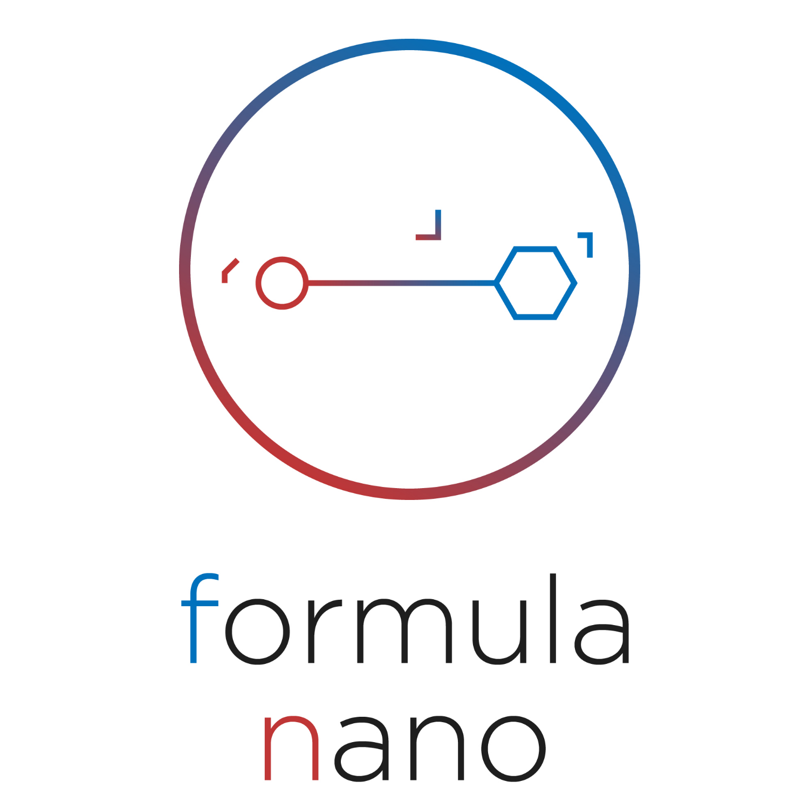
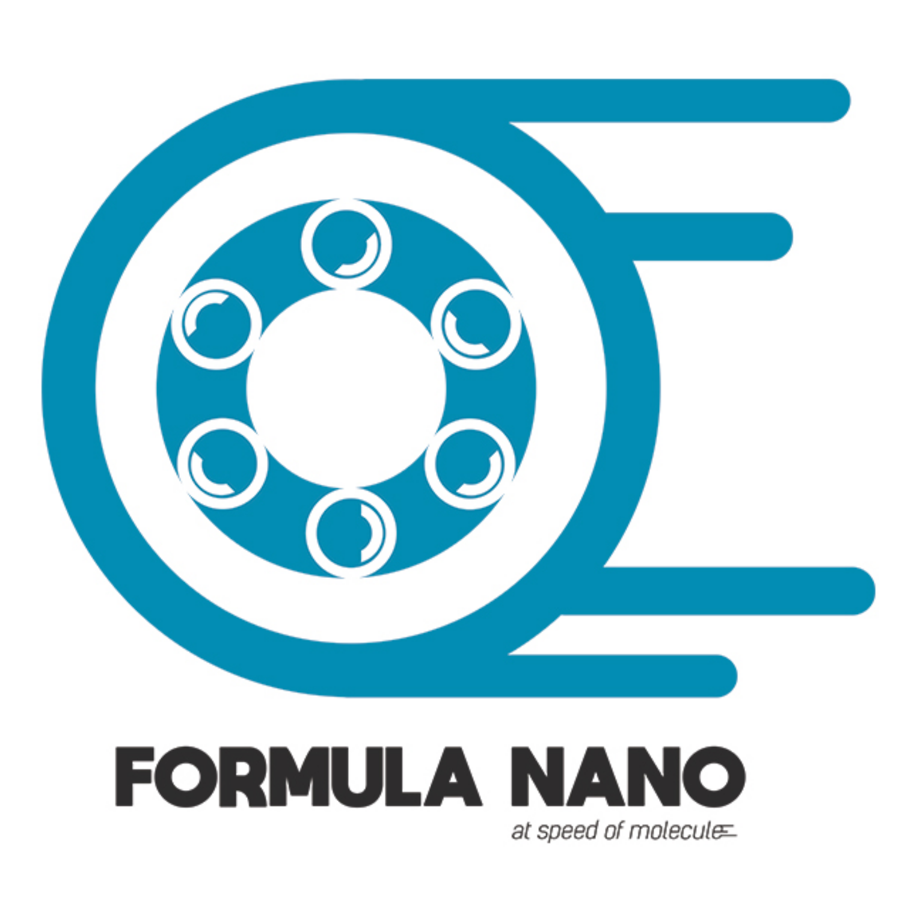

<!-- Main -->

<!-- One -->
<section id="one">
	

		<header class="major">
			<h1>Formula Nano Logo Selection</h1>
		</header>

<!-- Content -->
<h2 id="content">What makes a good logo?</h2>
<blockquote>A good logo is distinctive, appropriate, practical, graphic and simple in form, and it conveys the owner's intended message. A logo should be able to be printed at any size and, in most cases, be effective without color. A great logo essentially boils down to two things: great concept and great execution.

  <i>- Google</i>

</blockquote>

<!-- Elements -->
<h2 id="elements">Top 5 Logo Submissions</h2>

<ul class="actions fit">
	<li><a href="https://formulanano.typeform.com/to/etIg2A" target="_blank" class="button fit icon fa-discord">VOTE HERE</a></li>
</ul>

<h4>Larger size</h4>

	

		

		

		

		

		

	

</section>

