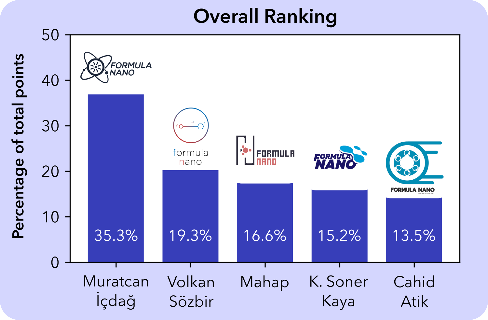
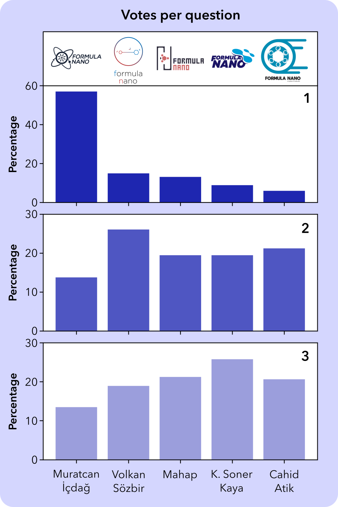
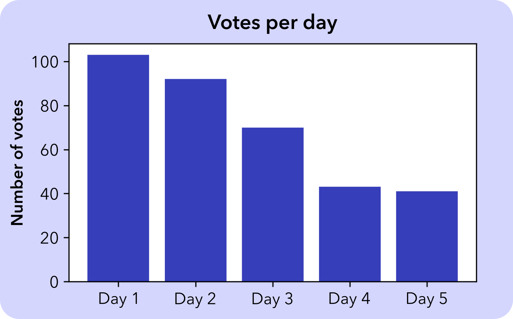

	<section id="one">
		

			<header class="major">
				<h1>Formula Nano Logo Selection</h1>
			</header>
			As an open source and community driven project, we wanted our logo to be designed and selected
			by the community. We received close to 40 logo submissions and it was challenging as the board
			members to pick the top 5 for voting. We opened the designs for voting between July 26 - 30
			and around 450 votes later here are the results! We would like to thank everyone who submitted
			their designs and participated in the voting.  

			

				

				<h3>Ranking logo designs</h3>
				

					We asked everyone to select the top three logos they liked.
					For each vote the first place got 3 points, the second place got 2 points and the third place
					got 1 point. As we mentioned in the survey, we didn't count the votes where the same logo
					was selected multiple times.
				

				

					With more than one third of total points, Muratcan's logo came first place!
					We would like to congratulate Muratcan for his great design.
					Check out his
					<a href="http://www.muratcanicdag.com" target="_blank">website</a>,
					<a href="https://www.youtube.com/muratcanicdag/" target="_blank">YouTube channel</a>, and
					<a href="https://www.instagram.com/muratcanicdag" target="_blank">instagram</a>
					to discover more of his work!
				

				

				

					
				

			

			 
			

				

					
				

				

				<h3>Looking at individual questions</h3>
				

					The questions were as follows:
					<ol>
						<li>Which logo do you like best?</li>
						<li>Which one is your second favorite logo?</li>
						<li>Which one is your third favorite logo?</li>
					</ol>
					As we look at the results for individual questions we can better understand how the overall
					ranking came to be.
					Even though Muratcan's design got 57% of the votes for the first place it got 35%
					in the overall vote because of the point system.
					Our intention with that was to pick the overall most liked logo.
				

				<h3>Poll popularity per day</h3>
				

				Lastly, as expected our poll was most popular first day and gradually leveled off during the 5 days.
				Even though not shown here, the ranking was pretty much the same thorughout the election.
				

				

				

			

			

			If you are interested, you can see the votes as a <code>csv</code> file from
			<a href="https://drive.google.com/open?id=1MlR_7F7bIRgqhDGjTcXZ7quKrctw8tFr" target="_blank">here</a>
			and the Python code used to analyze the results from
			<a href="https://drive.google.com/open?id=1pkfAg9FY9R-GwySMjNP73qFvPo_zDpbm" target="_blank">here</a>.
			

			<h2 id="elements">Top 5 Logo Submissions</h2>
			

				
					
				
			

			<h2>Larger size</h2>
			

				

					

					

					

					

					

				

			

		

	</section>

